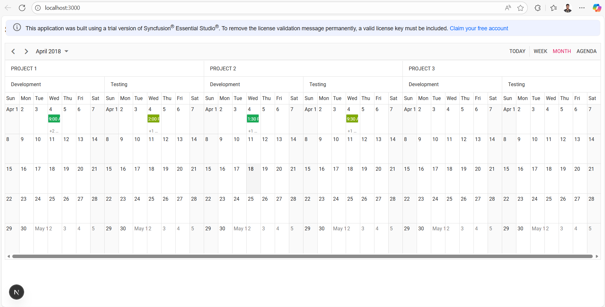

# Getting Started with Syncfusion React Schedule Component using Next.js
## Description

This repository showcases a demo Next.js application that demonstrates how to integrate the Syncfusion React Scheduler component in a fully client‑side environment. <br />
The application provides an interactive and responsive scheduling interface, allowing users to create, update, view, and delete events directly within the Scheduler without relying on any backend services.

## Project Structure
```
├── public
│     └── index.html           
├── server                     
│     └── server.js            
├── src
│     ├── app
│     │     ├── datasource.tsx              
│     │     ├── globals.css
│     │     ├── layout.tsx
│     │     ├── page.module.css
│     │     └── page.tsx
├── next-env.d.ts
├── next.config.js
├── package-lock.json
├── package.json
├── README.md
└── tsconfig.json
```

## Setup
#### <u>Cloning the repository</u>

1. To clone the sample repository locally, open the command prompt in the desired location and execute the following command.

    ```bash

    git clone https://github.com/SyncfusionExamples/ej2-nextjs-schedule.git

    ```

2. Navigate to the project directory:

    ```bash
    cd ej2-nextjs-schedule
    ```
#### <u>Installing Packages</u>

3. Install the required node modules by running the following command:

    ```bash
    npm install
    ```

## Running the Application
Run the application by using the following command

```bash
npm run dev
```

## Sample Outputs

*Image illustrating the Syncfusion React Scheduler in nextjs application* 

<br />
<br />
<br />
<br />

# Creating a Next.js Application Using Syncfusion® React Schedule Component
This section provides a step-by-step guide for setting up a Next.js application and integrating the Syncfusion® React Schedule component.

## What is Next.js?
Next.js is a React framework that makes it easy to build fast, SEO-friendly, and user-friendly web applications. It provides features such as server-side rendering, automatic code splitting, routing, and API routes, making it an excellent choice for building modern web applications.

## Prerequisites
Before getting started with the Next.js application, ensure the following prerequisites are met:

- Node.js 18.17 or later.

- The application is compatible with macOS, Windows, and Linux operating systems.

## Create a Next.js application
To create a new Next.js application, use one of the commands that are specific to either NPM or Yarn.

##### NPM
```bash
    npx create-next-app@latest
```
 
##### YARN
```bash
    yarn create next-app
```

Using one of the above commands will lead you to set up additional configurations for the project as below:

1. Define the project name: Users can specify the name of the project directly. Let’s specify the name of the project as `ej2-nextjs-schedule`.

    `CMD`
    ```bash
    √ What is your project named? » ej2-nextjs-schedule
    ```

2. Select the required packages.

    `CMD`
    ```bash
    √ What is your project named? ... ej2-nextjs-schedule
    √ Would you like to use TypeScript? ... No / `Yes`
    √ Would you like to use ESLint? ... No / `Yes`
    √ Would you like to use Tailwind CSS? ... `No` / Yes
    √ Would you like to use `src/` directory? ... No / `Yes`
    √ Would you like to use App Router? (recommended) ... No / `Yes`
    √ Would you like to customize the default import alias? ... `No`/ Yes
    Creating a new Next.js app in D:\ej2-nextjs-schedule.
    ```

3. Once complete the above mentioned steps to create ej2-nextjs-schedule, navigate to the directory using the below command:

    `CMD`
    ```bash
    cd ej2-nextjs-schedule
    ```
    The application is ready to run with default settings. Now, let’s add Syncfusion® components to the project.

## Install Syncfusion® React packages
Syncfusion® React component packages are available at [npmjs.com](https://www.npmjs.com/search?q=ej2-react). To use Syncfusion® React components in the project, install the corresponding npm package.

Here, the [React Schedule component](https://www.syncfusion.com/react-components/react-scheduler) is used in the project. To install the React Schedule component, use the following command:

##### NPM
```bash
npm install @syncfusion/ej2-react-schedule --save
```
##### YARN
```bash
yarn add @syncfusion/ej2-react-schedule
```

## Import Syncfusion® CSS styles
Syncfusion® React components come with [built-in themes](https://ej2.syncfusion.com/react/documentation/appearance/theme), which are available in the installed packages. It’s easy to adapt the Syncfusion® React components to match the style of your application by referring to one of the built-in themes.

Import the Material theme into the `src/app/globals.css` file and removed the existing styles in that file, as shown below:

#### globals.css
```bash
@import "../../node_modules/@syncfusion/ej2-base/styles/material.css";
@import "../../node_modules/@syncfusion/ej2-buttons/styles/material.css";
@import "../../node_modules/@syncfusion/ej2-calendars/styles/material.css";
@import "../../node_modules/@syncfusion/ej2-dropdowns/styles/material.css";
@import "../../node_modules/@syncfusion/ej2-inputs/styles/material.css";
@import "../../node_modules/@syncfusion/ej2-lists/styles/material.css";
@import "../../node_modules/@syncfusion/ej2-navigations/styles/material.css";
@import "../../node_modules/@syncfusion/ej2-popups/styles/material.css";
@import "../../node_modules/@syncfusion/ej2-splitbuttons/styles/material.css";
@import "../../node_modules/@syncfusion/ej2-react-schedule/styles/material.css";
```

To know more about built-in themes and CSS reference for individual components, refer to the [themes](https://ej2.syncfusion.com/react/documentation/appearance/theme) section.

## Add Syncfusion® React component
Follow the below steps to add the React Schedule component to the Next.js project:

1. Before adding the Schedule component to your markup, create a `datasource.tsx` file within the src/app/ folder and add the Schedule component data.

    #### datasource.tsx
    ```bash
    export let timelineResourceData: Object[] = [
        {
            Id: 61,
            Subject: 'Decoding',
            StartTime: new Date(2018, 3, 4, 9, 30),
            EndTime: new Date(2018, 3, 4, 10, 30),
            IsAllDay: false,
            ProjectId: 2,
            TaskId: 2
        }, {
            Id: 62,
            Subject: 'Bug Automation',
            StartTime: new Date(2018, 3, 4, 13, 30),
            EndTime: new Date(2018, 3, 4, 16, 30),
            IsAllDay: false,
            ProjectId: 2,
            TaskId: 1
        }, {
            Id: 63,
            Subject: 'Functionality testing',
            StartTime: new Date(2018, 3, 4, 9),
            EndTime: new Date(2018, 3, 4, 10, 30),
            IsAllDay: false,
            ProjectId: 1,
            TaskId: 1
        }, {
            Id: 64,
            Subject: 'Resolution-based testing',
            StartTime: new Date(2018, 3, 4, 12),
            EndTime: new Date(2018, 3, 4, 13),
            IsAllDay: false,
            ProjectId: 1,
            TaskId: 1
        }, {
            Id: 65,
            Subject: 'Test report Validation',
            StartTime: new Date(2018, 3, 4, 15),
            EndTime: new Date(2018, 3, 4, 18),
            IsAllDay: false,
            ProjectId: 1,
            TaskId: 1
        }, {
            Id: 66,
            Subject: 'Test case correction',
            StartTime: new Date(2018, 3, 4, 14),
            EndTime: new Date(2018, 3, 4, 16),
            IsAllDay: false,
            ProjectId: 1,
            TaskId: 2
        }, {
            Id: 67,
            Subject: 'Bug fixing',
            StartTime: new Date(2018, 3, 4, 14, 30),
            EndTime: new Date(2018, 3, 4, 18, 30),
            IsAllDay: false,
            ProjectId: 2,
            TaskId: 2
        }, {
            Id: 68,
            Subject: 'Run test cases',
            StartTime: new Date(2018, 3, 4, 17, 30),
            EndTime: new Date(2018, 3, 4, 19, 30),
            IsAllDay: false,
            ProjectId: 1,
            TaskId: 2
        }, {
            Id: 70,
            Subject: 'Bug Automation',
            StartTime: new Date(2018, 3, 4, 18, 30),
            EndTime: new Date(2018, 3, 4, 20),
            IsAllDay: false,
            ProjectId: 2,
            TaskId: 1
        }
    ];
    ```
2. Then, import and define the Schedule component in the `src/app/page.tsx` file, as shown below:

    #### page.tsx
    ```bash
    'use client'
    import {
    Week, Month, Agenda, ScheduleComponent, ViewsDirective, ViewDirective, EventSettingsModel, ResourcesDirective, ResourceDirective, Inject, Resize, DragAndDrop
    } from '@syncfusion/ej2-react-schedule';
    import { timelineResourceData } from './datasource';

    export default function Home() {
    const eventSettings: EventSettingsModel = { dataSource: timelineResourceData }
    const group = { byGroupID: false, resources: ['Projects', 'Categories'] }

    const projectData: Object[] = [
        { text: 'PROJECT 1', id: 1, color: '#cb6bb2' },
        { text: 'PROJECT 2', id: 2, color: '#56ca85' },
        { text: 'PROJECT 3', id: 3, color: '#df5286' },
    ];
    const categoryData: Object[] = [
        { text: 'Development', id: 1, color: '#1aaa55' },
        { text: 'Testing', id: 2, color: '#7fa900' }
    ];
    return (
        <>
        <h2>Syncfusion React Schedule Component</h2>
        <ScheduleComponent width='100%' height='550px' currentView='Month' selectedDate={new Date(2018, 3, 4)} eventSettings={eventSettings} group={group} >
            <ViewsDirective>
            <ViewDirective option='Week' />
            <ViewDirective option='Month' />
            <ViewDirective option='Agenda' />
            </ViewsDirective>
            <ResourcesDirective>
            <ResourceDirective field='ProjectId' title='Choose Project' name='Projects' allowMultiple={false}
                dataSource={projectData} textField='text' idField='id' colorField='color'>
            </ResourceDirective>
            <ResourceDirective field='TaskId' title='Category' name='Categories' allowMultiple={true}
                dataSource={categoryData} textField='text' idField='id' colorField='color'>
            </ResourceDirective>
            </ResourcesDirective>
            <Inject services={[Week, Month, Agenda, Resize, DragAndDrop]} />
        </ScheduleComponent>
        </>
    )
    }
    ```
    
## Run the application
To run the application, use the following command:

##### NPM
```bash
npm run dev
```

##### YARN
```bash
yarn run dev
```

To learn more about the functionality of the Next.js with Schedule component, refer to the [documentation](https://ej2.syncfusion.com/react/documentation/schedule/nextjs-getting-started).